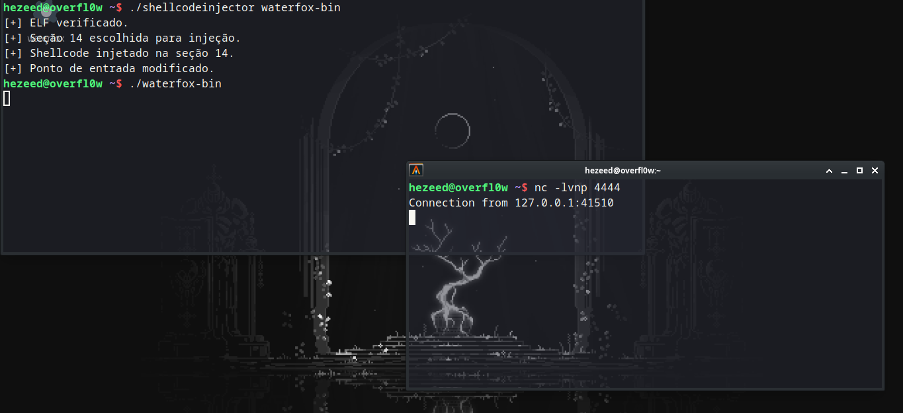

**Shellcode Injector** 

## Funcionalidade

- Verifica se o arquivo fornecido é um ELF.
- Localiza seções executáveis dentro do arquivo ELF.
- Injeta um shellcode específico em uma seção executável.
- Modifica o ponto de entrada do ELF para redirecionar a execução para o shellcode injetado.

## Shellcode

O shellcode implementado neste projeto realiza as seguintes operações:
1. Cria um socket.
2. Conecta-se a um servidor em `127.0.0.1` na porta `4444`.
3. Executa um shell (`/bin/sh`).

```bash
gcc -o shellcode_injector shellcode_injector.c
```

```bash
./shellcode_injector <arquivo_elf>
```
